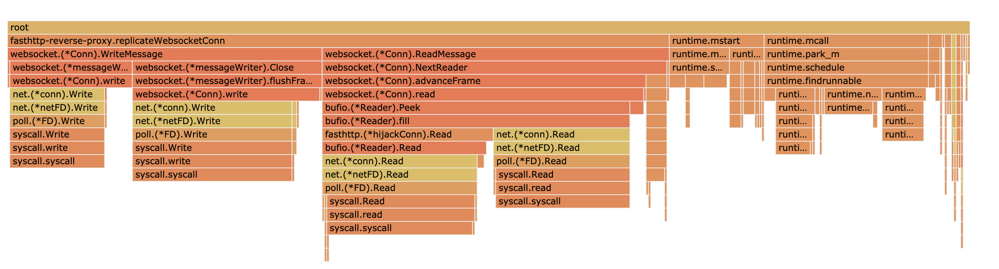

# Websocket Benchmark

display benchmark code and result:

### Benchmark Client

```js
// benchmark/ws_benchmark.js
const WebSocket = require('ws')

// host = "ws://localhost:8080/echo" // backend 
host = "ws://localhost:8081/echo" // proxy

function benchmark() {
    setInterval(() => {
        console.log("current avg delta(ms): ", avgDelta.toFixed(3));
    }, 2000)

    for (let i = 0; i < 100; i++) {
        delay_test()
    }
}


var testCnt = 0
var avgDelta = 0

function count_delay(delta) {
    testCnt++
    if (testCnt === 0) {
        avgDelta = delta
        return
    }

    avgDelta = avgDelta * ((testCnt - 1) / testCnt) + delta * (1 / testCnt)
}

function delay_test() {
    var c = new WebSocket(host)
    c.onmessage = (evt) => {
        let now = (new Date()).getTime()
        count_delay(now - (+evt.data))
        // console.log("recv:", evt.data)
    }
    c.onerror = (evt) => {
        console.error("error:", evt.data)
    }
    c.onopen = (e) => {
        setInterval(() => {
            c.send((new Date()).getTime().toString())
        }, 100)
    }
}

benchmark()
```

### Websocket Proxy Server

```go
// benchmark/ws_proxy_benchmark.go
package main

import (
	"log"
	"os"
	"os/signal"
	"runtime/pprof"
	"syscall"

	"github.com/valyala/fasthttp"
	proxy "github.com/yeqown/fasthttp-reverse-proxy"
)

var (
	proxyServer = proxy.NewWSReverseProxy("localhost:8080", "/echo")
)

// ProxyHandler ... fasthttp.RequestHandler func
func ProxyHandler(ctx *fasthttp.RequestCtx) {
	switch string(ctx.Path()) {
	case "/echo":
		proxyServer.ServeHTTP(ctx)
	case "/":
		// homeView(ctx)
		fasthttp.ServeFileUncompressed(ctx, "./index.html")
	default:
		ctx.Error("Unsupported path", fasthttp.StatusNotFound)
	}
}

// TODO: pprof capture
func main() {
	fd, err := os.Create("./cpu.prof")
	defer fd.Close()
	if err != nil {
		panic(err)
	}
	if err = pprof.StartCPUProfile(fd); err != nil {
		panic(err)
	}

	ch := make(chan os.Signal)
	signal.Notify(ch, syscall.SIGINT, syscall.SIGQUIT, syscall.SIGHUP)

	go func() {
		for s := range ch {
			log.Printf("got signal = %v", s)
			if s == syscall.SIGINT || s == syscall.SIGQUIT {
				pprof.StopCPUProfile()
				os.Exit(2)
			}
		}
	}()

	log.Println("serving on: 8081")
	if err := fasthttp.ListenAndServe(":8081", ProxyHandler); err != nil {
		log.Fatal(err)
	}
}
```

### Backend Server

ref to [example/wx-fasthttp-reverse-proxy](../examples/ws-fasthttp-reverse-proxy/server/main.go)


### Porxy server pprof output

100 Client, each client send 1 msg per 100 millsecond

1. Flame graph


2. Top Table

```sh
Flat	Flat%	Sum%	Cum	Cum%	Name	Inlined?
2.31s	55.53%	55.53%	2.32s	55.77%	syscall.syscall	
0.23s	5.53%	61.06%	0.23s	5.53%	runtime.kevent	
0.22s	5.29%	66.35%	0.22s	5.29%	runtime.pthread_cond_signal	
0.20s	4.81%	71.15%	1.34s	32.21%	github.com/fasthttp/websocket.(*Conn).write	
0.19s	4.57%	75.72%	0.19s	4.57%	runtime.pthread_cond_wait	
0.19s	4.57%	80.29%	0.19s	4.57%	runtime.nanotime	
0.08s	1.92%	82.21%	0.08s	1.92%	runtime.usleep	
0.06s	1.44%	83.65%	0.11s	2.64%	runtime.scanobject	
0.06s	1.44%	85.10%	0.08s	1.92%	runtime.notetsleep	
0.06s	1.44%	86.54%	0.06s	1.44%	runtime.madvise	
0.06s	1.44%	87.98%	0.06s	1.44%	bufio.(*Reader).Discard	
0.05s	1.20%	89.18%	0.05s	1.20%	runtime.memmove	
0.04s	0.96%	90.14%	0.04s	0.96%	runtime.pthread_cond_timedwait_relative_np	
0.03s	0.72%	90.87%	0.74s	17.79%	github.com/valyala/fasthttp.(*hijackConn).Read	
0.02s	0.48%	91.35%	0.26s	6.25%	runtime.netpoll	
0.01s	0.24%	91.59%	0.26s	6.25%	runtime.sysmon	
0.01s	0.24%	91.83%	0.20s	4.81%	runtime.stopm	
0.01s	0.24%	92.07%	0.71s	17.07%	runtime.findrunnable	
0.01s	0.24%	92.31%	0.71s	17.07%	bufio.(*Reader).Read	
0	0.00%	92.31%	1.11s	26.68%	syscall.write	
0	0.00%	92.31%	1.22s	29.33%	syscall.read	
0	0.00%	92.31%	1.11s	26.68%	syscall.Write	
0	0.00%	92.31%	1.22s	29.33%	syscall.Read	
0	0.00%	92.31%	0.06s	1.44%	runtime.timerproc	
0	0.00%	92.31%	0.29s	6.97%	runtime.systemstack	
0	0.00%	92.31%	0.05s	1.20%	runtime.sysUsed	
0	0.00%	92.31%	0.19s	4.57%	runtime.startm	
0	0.00%	92.31%	0.25s	6.01%	runtime.semawakeup	
0	0.00%	92.31%	0.23s	5.53%	runtime.semasleep	
0	0.00%	92.31%	0.71s	17.07%	runtime.schedule	
0	0.00%	92.31%	0.71s	17.07%	runtime.park_m	
0	0.00%	92.31%	0.25s	6.01%	runtime.notewakeup	
0	0.00%	92.31%	0.05s	1.20%	runtime.notetsleepg	
0	0.00%	92.31%	0.07s	1.68%	runtime.notetsleep_internal	
0	0.00%	92.31%	0.19s	4.57%	runtime.notesleep	
0	0.00%	92.31%	0.09s	2.16%	runtime.newobject	
0	0.00%	92.31%	0.26s	6.25%	runtime.mstart1	
0	0.00%	92.31%	0.41s	9.86%	runtime.mstart	
0	0.00%	92.31%	0.71s	17.07%	runtime.mcall	
0	0.00%	92.31%	0.09s	2.16%	runtime.mallocgc	
0	0.00%	92.31%	0.03s	0.72%	runtime.lock	
0	0.00%	92.31%	0.17s	4.09%	runtime.injectglist	
0	0.00%	92.31%	0.09s	2.16%	runtime.gcDrainN	
0	0.00%	92.31%	0.04s	0.96%	runtime.gcDrain	
0	0.00%	92.31%	0.04s	0.96%	runtime.gcBgMarkWorker.func2	
0	0.00%	92.31%	0.03s	0.72%	runtime.gcBgMarkWorker	
0	0.00%	92.31%	0.09s	2.16%	runtime.gcAssistAlloc1	
0	0.00%	92.31%	0.09s	2.16%	runtime.gcAssistAlloc.func1	
0	0.00%	92.31%	0.09s	2.16%	runtime.gcAssistAlloc	
0	0.00%	92.31%	0.05s	1.20%	runtime.entersyscall_sysmon	
0	0.00%	92.31%	0.05s	1.20%	runtime.(*mheap).alloc_m	
0	0.00%	92.31%	0.05s	1.20%	runtime.(*mheap).allocSpanLocked	
0	0.00%	92.31%	0.05s	1.20%	runtime.(*mheap).alloc.func1	
0	0.00%	92.31%	1.11s	26.68%	net.(*netFD).Write	
0	0.00%	92.31%	1.26s	30.29%	net.(*netFD).Read	
0	0.00%	92.31%	1.11s	26.68%	net.(*conn).Write	
0	0.00%	92.31%	1.26s	30.29%	net.(*conn).Read	
0	0.00%	92.31%	1.11s	26.68%	internal/poll.(*FD).Write	
0	0.00%	92.31%	1.26s	30.29%	internal/poll.(*FD).Read	
0	0.00%	92.31%	2.86s	68.75%	github.com/yeqown/fasthttp-reverse-proxy.replicateWebsocketConn	
0	0.00%	92.31%	1.35s	32.45%	github.com/fasthttp/websocket.(*messageWriter).flushFrame	
0	0.00%	92.31%	0.82s	19.71%	github.com/fasthttp/websocket.(*messageWriter).Close	
0	0.00%	92.31%	1.39s	33.41%	github.com/fasthttp/websocket.(*Conn).read	
0	0.00%	92.31%	1.40s	33.65%	github.com/fasthttp/websocket.(*Conn).advanceFrame	
0	0.00%	92.31%	1.36s	32.69%	github.com/fasthttp/websocket.(*Conn).WriteMessage	
0	0.00%	92.31%	1.50s	36.06%	github.com/fasthttp/websocket.(*Conn).ReadMessage	
0	0.00%	92.31%	1.49s	35.82%	github.com/fasthttp/websocket.(*Conn).NextReader	
0	0.00%	92.31%	1.33s	31.97%	bufio.(*Reader).fill	
0	0.00%	92.31%	1.33s	31.97%	bufio.(*Reader).Peek	
```