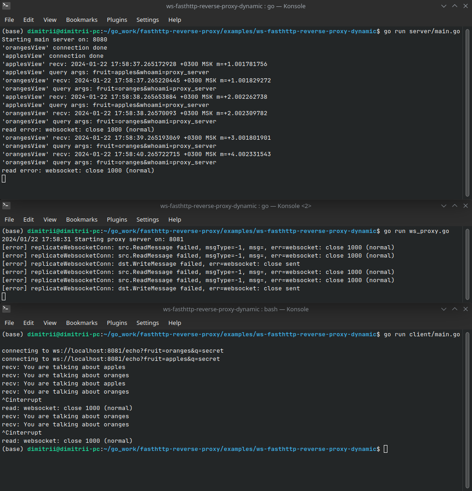
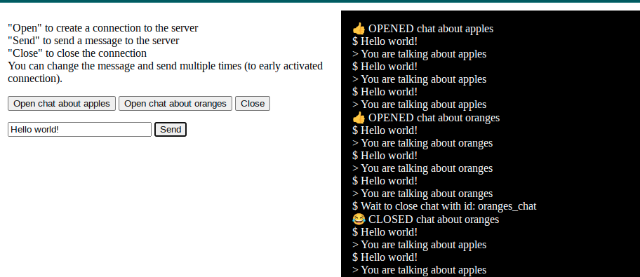

# ws-fasthttp-reverse-proxy

### get start demo 
Run main server and proxy server
```sh
go run server/main.go # listen on localhost:8080/echo
go run ws_proxy.go    # listen on localhost:8081/echo
```

Run client examples: either check golang one
```sh
go run client/main.go # connect to localhost:8081/echo
```
or plain JS: open `index.html` file

### screenshots


