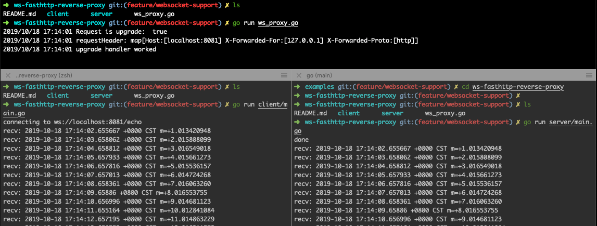

# ws-fasthttp-reverse-proxy

### get start demo 
```sh
go run server/main.go # listen on localhost:8080/echo
go run ws_proxy.go    # listen on localhost:8081/echo
go run client/main.go # connect to localhost:8081/echo
```

### screenshot
